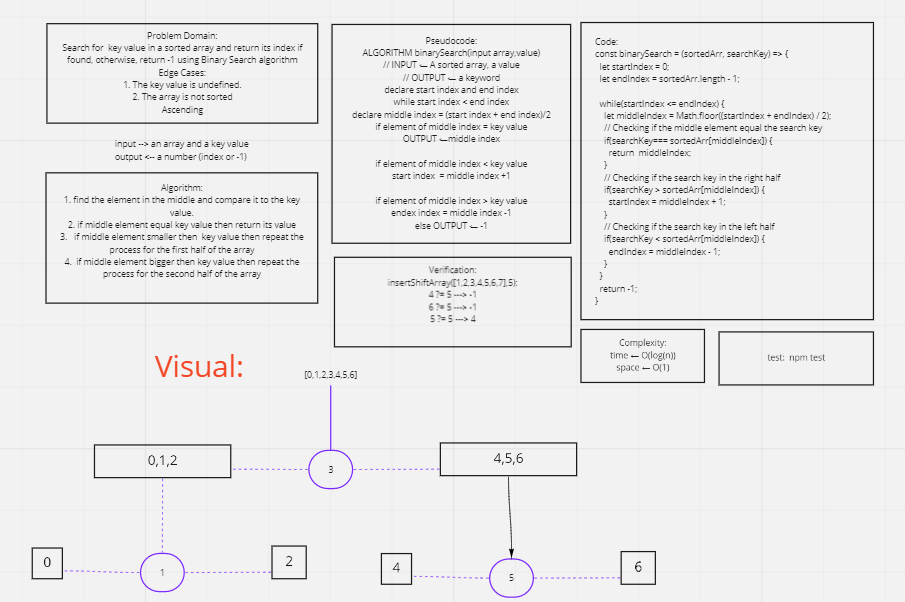

# Reverse an Array
To run this function, you need an input array

## Challenge
A function that takes an array as an argument and return an array with elements in reversed order.

## Approach & Efficiency
The approach was to loop through the original array and push its elements in reverse order to the output array.

## Solution
White Board Image:

# Shift an Array
Add a value in the middle of an array

## Challenge Description
find the middle index of an array and add a value to it by shifting its element.

## Approach & Efficiency
The approach first was to make sure that array is not empty and the value is defined.
Then looping through the array to find the middle index, adding the required value at this index.

## Solution
White Board Image:

# Binary Search Array
Search for a value in an array using Binary search algorithm.

## Challenge Description
search for a key value in an array, when found return its index , other wise return -1 using binary search

## Approach & Efficiency
The approach was to split the array in two halves, check if the element at the middle equals the key value, if not and bigger repeat the process for the right half. If not and smaller repeat the process for the left half. Return its index if found or -1 otherwise.

## Solution
White Board Image:

# Singly Linked List
Linked list is s a linear data structure (list) of linked nodes, each node refer to the next one.

## Challenge
Creating a linked list class that can add nodes, check if a node exists and, display a string of values to the nodes in this list.

## Approach & Efficiency
* The approach was to create a ES6 class for creating each node, and another class to create an empty linked list. Later, we can create instances of these to classes to complete the task given.
* Big O for Time: O(n)
  - inserting a value: O(1)
  - Searching if a value is included: O(n)
  - Printing a string of values: O(n)
* Big O for Space: O(1)
  - inserting a value: O(1)
  - Searching if a value is included: O(1)
  - Printing a string of values: O(1)

## API
1. insert(): 
   - create a new node by creating an instance of the Node class.
   - Check if there is a header node, if not set the new node as a header.
   - if the header node exists then set the new node as the head node *after* setting the head node to the next node.
   - Catch an error if there is one.
2. include:
   - Search for a value in nodes starting from the head node.
   - Loop through existing nodes one by one and check if any has the value required to be found.
   - return true if it is found, and false otherwise
   - Catch an error if there is one.
3. toString():
   - Tp print out a string of values in the list.
   - Define an empty string at first.
   - Start from the head node.
   - loop through the nodes and add their values to the empty string.
   - return the string when done looping
   - Catch an error if there is one.

## [Code link](../challenges/linkedList/linked-list.js)