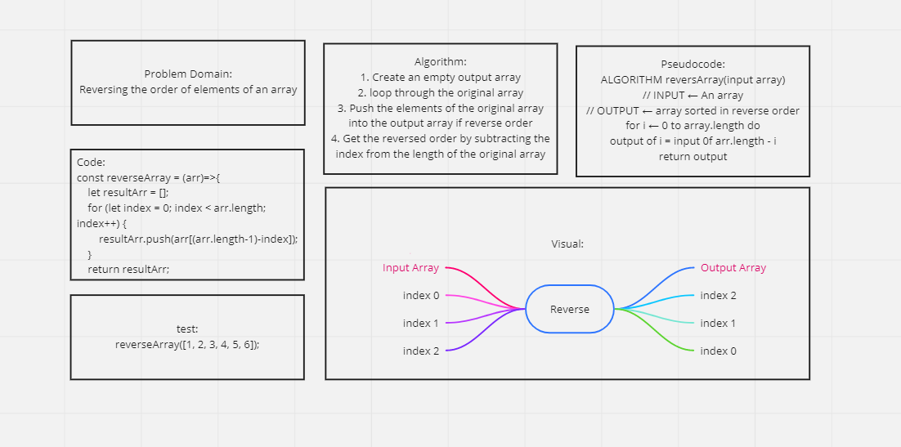
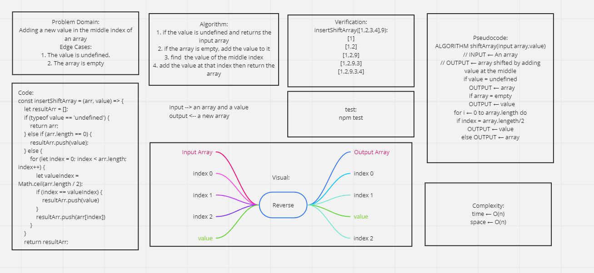

# Reverse an Array
To run this function, you need an input array

## Challenge
A function that takes an array as an argument and return an array with elements in reversed order.

## Approach & Efficiency
The approach was to loop through the original array and push its elements in reverse order to the output array.

## Solution
White Board Image:

# Shift an Array
Add a value in the middle of an array

## Challenge Description
find the middle index of an array and add a value to it by shifting its element.

## Approach & Efficiency
The approach first was to make sure that array is not empty and the value is defined.
Then looping through the array to find the middle index, adding the required value at this index.

## Solution
White Board Image:
