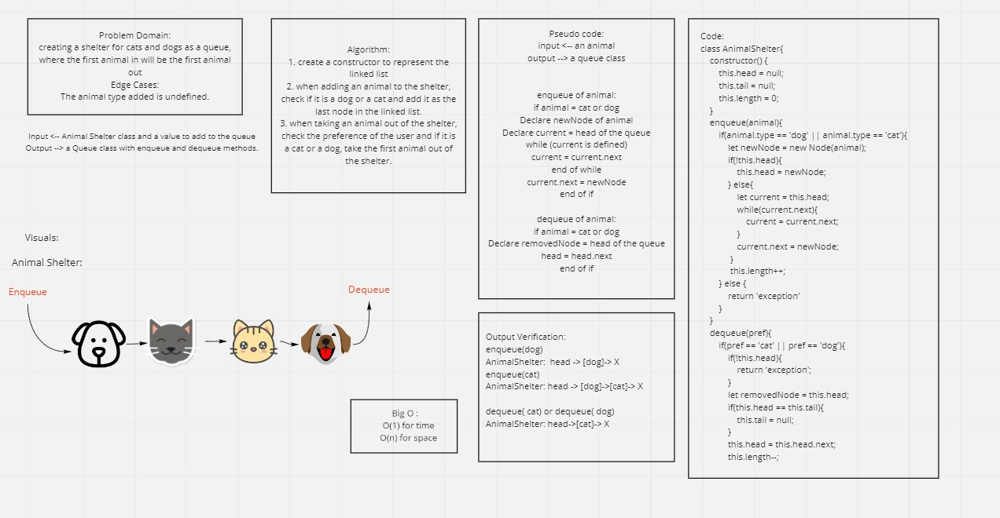

# Animal Shelter

# Challenge Summary
A queue class has two methods to enqueue and dequeue to add and remove from the queue, working as First in, First out.

## Challenge Description
Creating a queue for animal shelters that can only add cats and dogs to the queue.

## Approach & Efficiency
- Checking if the animal entering the shelter is a cat or a dog then adding it to the end of the queue.
- When removing an animal, check the preference of the user, and if it is a cat or a dog, remove the first animal in the queue.
- Big O: 
   * For time : O(1);
   * For space: O(n);

## Solution

## Test:
* ` npm test animal-shelter.test`
* Code : [Fifo Animal Shelter](./animal-shelter.js)
