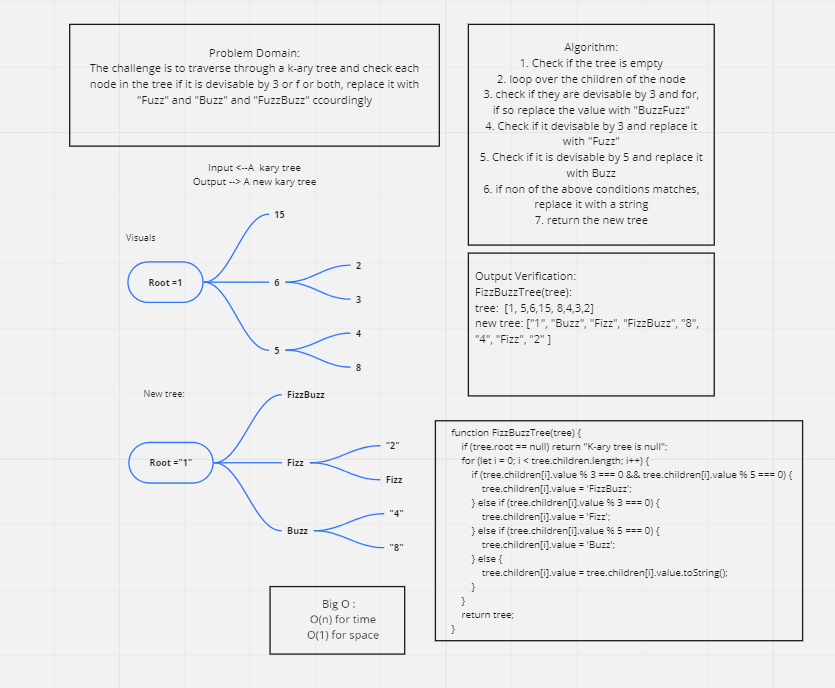

# Challenge Summary
##  Trees
* Trees are a way to represent data in a non linear way (unlike arrays, linked lists, stacks and queues).
* K-ary trees are composed of nodes with each node  have children nodes (not limited to two children as in Binary tree).

## Challenge Description
The challenge is to traverse through the tree and check each node if it is devisable by 3, 5 or both. If so, return "Fizz", "Buzz" and "FizzBuzz" accordingly. and if it is not, replace it with its string.

## Approach & Efficiency
The approach was to save the children in an array and loop through this array to check if a condition is matched.

## Solution

## Test
* `npm test fizz-buzz-tree.test.js`
* [Code](../fizzBuzzTree/fizz-buzz-tree.js)