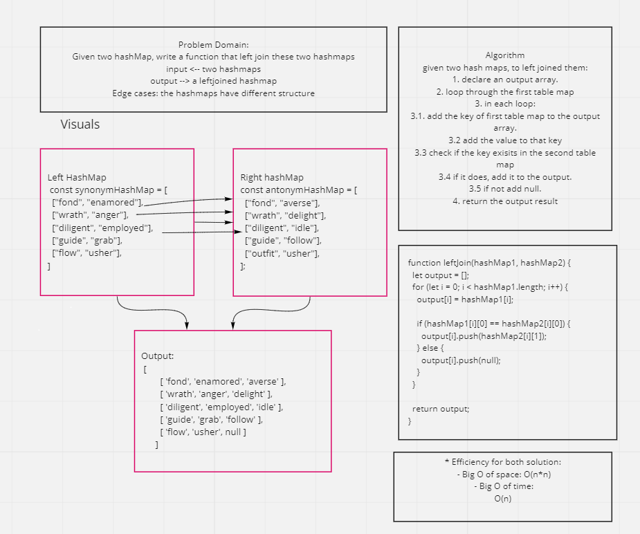

# Hashmap LEFT JOIN
* Hashmap vs Hashtable: 
   - Hashtables and hashmaps are data structures that store data in an array-like format, using key/value pairs, where the (hashed) key corresponds to the index in the array.
   - HashMap is non synchronized. It is not-thread safe and can't be shared between many threads without proper synchronization code whereas Hashtable is synchronized.
   - HashMap allows one null key and multiple null values whereas Hashtable doesn't allow any null key or value.
   - Hashmap represented in JavaScript using `Map() object `.

* LEFT JOIN:
  - a left join returns all the values from the left table
  - plus matched values from the right table or NULL in case of no matching join predicate.
  

## Challenge
Write a function that LEFT JOINs two hashmaps into a single data structure.
The first parameter is a hashmap that has word strings as keys, and a synonym of the key as values.
The second parameter is a hashmap that has word strings as keys, and antonyms of the key as values.

## Approach & Efficiency
The approach was to loop through the first hash map and search for matching keys in the second hash map and add the value of the matched keys to the output results.
* Efficiency
 - Big O of space: O(n*n)
 - Big O of time: O(n)

## Solution

## Resources:
* [Hashmap](https://medium.com/@martin.crabtree/javascript-tracking-key-value-pairs-using-hashmaps-7de6df598257)