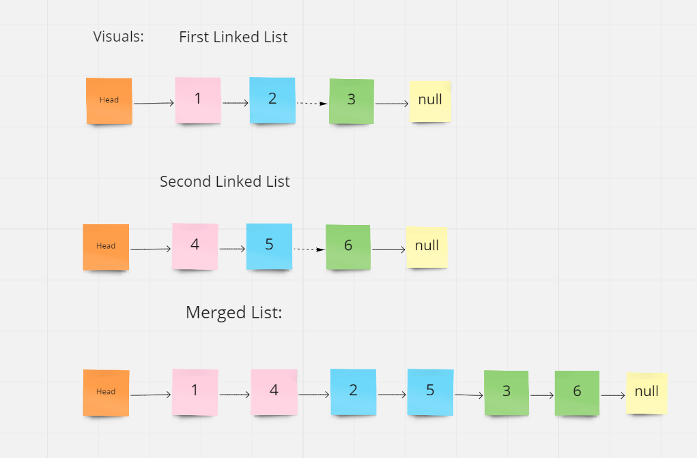
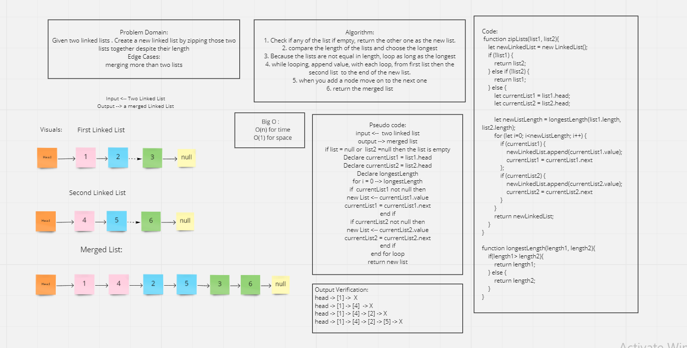

# Linked List - Zip Two lists

## Challenge Summary
Creating a linked list class that can add nodes, then creating a function that can merge two linked list without sorting them.

## Challenge Description
Given two linked list (each one with different length), create a third list by zipping those lists without sorting them.

## Approach & Efficiency
In my Approach I depended on two things:
1. the append() method in the linked list which add a node to the end of the list.
2. looping as many long as the longest list in length and keep adding nodes to the tail of the new list.

## Big O:
- For time: O(n)
- For Space: O(1)

## Code Link:
* [ll-Zip](./ll-zip.js)
* To run the test: ` npm test ll-zip-test`

## Solution
White Board Image:

