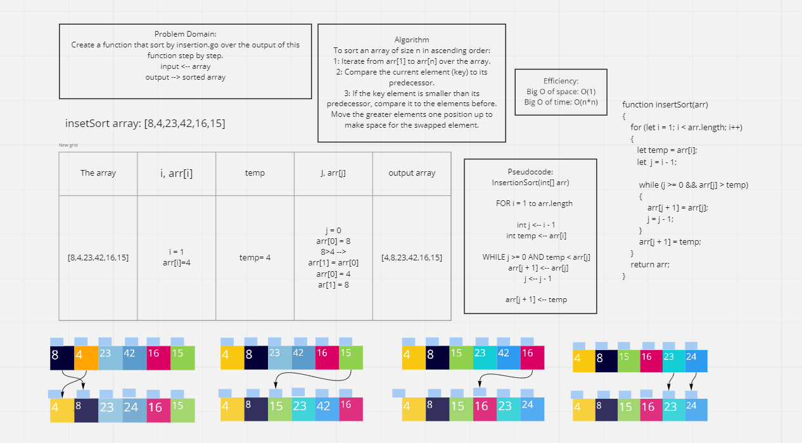

# Code Challenge 27: Merge Sort
# Challenge Summary
* **Merge sort** is a Divide and Conquer algorithm.
* Dividing Phase: It divides the input array into two halves, and each half for two halves until the half is one element of the array.
* Merging Phase: It compare these elements and merging them after sorting them.
* It is fast because it is implemented recursively, work faster in larger array size or datasets.
* It is useful for sorting linked lists

## Challenge Description
Create a function that sort by insertion.go over the output of this function step by step.

## Approach & Efficiency
* The approach was to loop over the array and compare the element with the element that stands before it and put the smaller one of them fist, and keep doing that until the first element is reach, keep doing that for each element in the array.
* Efficiency:
 - Big O of space: O(n) 
 - Big O of time: O(nLogn) 

## Solution

## Resources:
* [Insertion Sort](https://www.geeksforgeeks.org/insertion-sort/)

## The Code:
* To test run: ` npm test insertSort.test`
* [The code](../selectionSort/selectionSort.js)