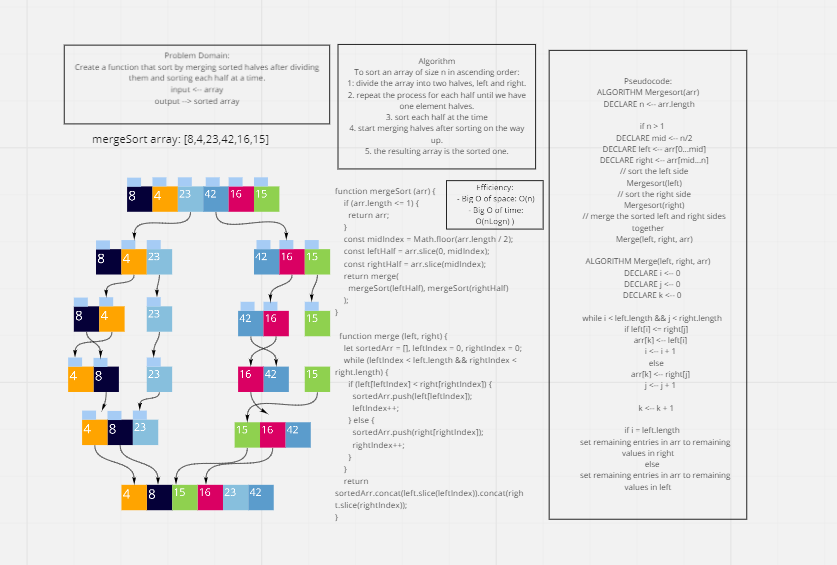

# Code Challenge 27: Merge Sort
# Challenge Summary
* **Merge sort** is a Divide and Conquer algorithm.
* Dividing Phase: It divides the input array into two halves, and each half for two halves until the half is one element of the array.
* Merging Phase: It compare these elements and merging them after sorting them.
* It is fast because it is implemented recursively, work faster in larger array size or datasets.
* It is useful for sorting linked lists

## Challenge Description
Create a function that sort by merging sorted halves after dividing them ans sorting each half at a time.

## Approach & Efficiency
* The approach was to Divide and Conquer, instead of sorting all of the array at once, divide it into smaller halves and sort each small half at a time, when all halves are sorted merges them in the right order of the sorting.
* Efficiency:
 - Big O of space: O(n) 
 - Big O of time: O(nLogn) 

## Solution

## Resources:
* [Merge Sort](https://javascript.plainenglish.io/javascript-merge-sort-3205891ac060)

## The Code:
* To test run: ` npm test mergeSort.test`
* [The code](../mergeSort/mergeSort.js)