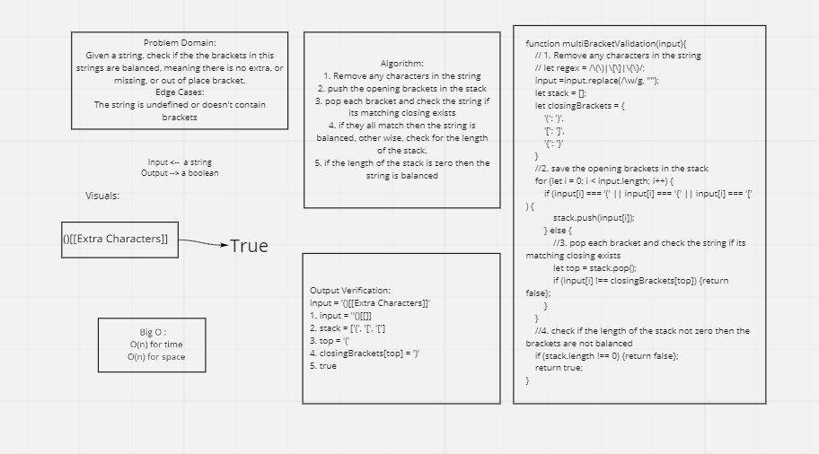

# Multi Brackets Validation
# Challenge Summary
- Multi Brackets Validation is a common interview question and a useful function, it checks for any missing brackets or any extra one!
- For example: it is what the compiler uses when checking for errors in the code.

## Challenge Description
Given a string, check if the the brackets in this strings are balanced, meaning there is no extra, or missing, or out of place bracket.

## Approach & Efficiency
The approach was to use a stack and store all of the opening brackets, and then check if the popped bracket match the opening one.
Big O:
For time: O(n)
For space: O(n)

## Solution

## Test:
* `npm test multi-bracket-validation.test `
* [Resource](https://paulrohan.medium.com/parenthesis-matching-problem-in-javascript-the-hacking-school-hyd-7d7708278911)