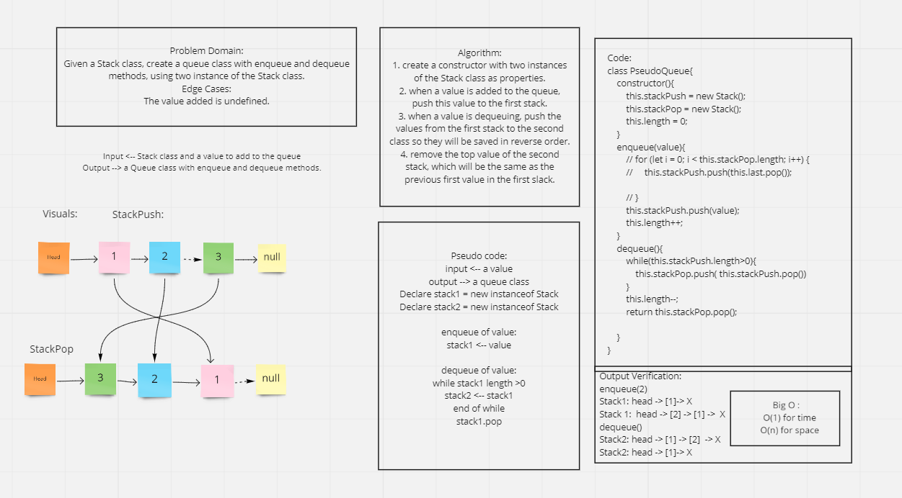

# Challenge Summary
A queue is a data type that represent a queue of data, what goes first into this queue (enqueue) comes out first (dequeue), which is known as FIFO (First in First Out), can be used in programming as an example when providing a service to the users, the user that request the service first, will be served first.

## Challenge Description
Building a queue by using two instance of a Stack class. One of them is used for enqueue and the second one is for dequeue.
The reason for using two stacks rather than one, is because the stack works LIFO.

## Approach & Efficiency
* The approach is to create two instances of the Stack class and set them as properties to the queue.
* Use the first instance to save every data that is push to the queue.
* Use the second instance to push every data from the first instance so they would be saved in reversed and used later when dequeuing.

## Solution

## Resources:
[Reference1](https://medium.com/@larry.sassainsworth/implementing-a-queue-using-stacks-in-javascript-fe78176ba028)
[Reference2](http://progressivecoder.com/implementing-queue-using-stacks-in-javascript/)