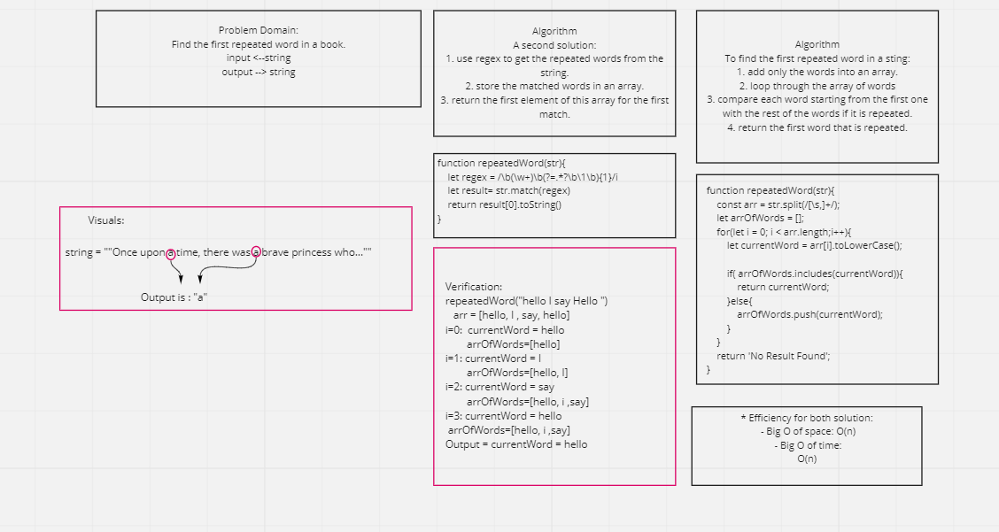

# Code Challenge 31: Find the first repeated word in a book.

# Challenge Summary
This challenge would re-useable to help you find any repeated words in your string and return the first one.

## Challenge Description
Find the first repeated words in a string.

## Approach & Efficiency
- Two approach to solve this challenge:
  1. using regex for finding the duplicated words in the string.
  2. Converting the string into array of words and check the array for the first duplicated element

- Efficiency for both solution:
 - Big O of space: O(n)
 - Big O of time: O(n)

## Solution

* Code: 
* Test: `npm test repeated-word.test`
* [Resource](https://regex101.com/r/dI9Jbh/1)