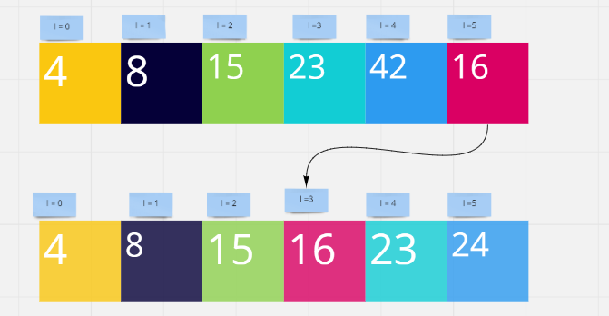
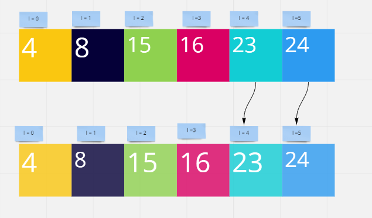

# Insertion Sort:
## Trace:
- Sample Array: [8,4,23,42,16,15]
### Pass1:
1. The first loop we take the element at index=1 until index=5, and compare it to the element at index=0;
2. Save the smaller element at index=0 , and the other one at index = 1;
3. if the first element is smaller, no change is needed.

### Pass2:
1. The second loop we take the element at index=2 until index=5, and compare it with the two previous elements at index=0 and index=1.
2. At first we compare it with the element of index=1;
3. Save the smaller element at index=1 , and the other one at index = 2;
4. Repeat the steps from **Pass1**.

### Pass3:
1. The third loop we take the element at index=3 until index=5, and compare it with the three previous elements at index=0 and index=1 and index=2.
2. At first we compare it with the element of index=2;
3. Save the smaller element at index=1 , and the other one at index = 2 and so on;
4. Repeat the steps from **Pass1** and **Pass2**.

### Pass4:
1. The forth loop we take the element at index=4 until index=5, and compare it with the four previous elements at index=0 and index=1 and index=2.
2. At first we compare it with the element of index=3;
3. Save the smaller element at index=1 , and the other one at index = 2 and so on;
4. Repeat the previous steps.

### Pass5:
1. The fifth loop we take the element at index=5 until and compare it with the five previous elements at index=0 and index=1 and index=2.
2. At first we compare it with the element of index=4;
3. Save the smaller element at index=1 , and the other one at index = 2 and so on;
4. Repeat the previous steps.

