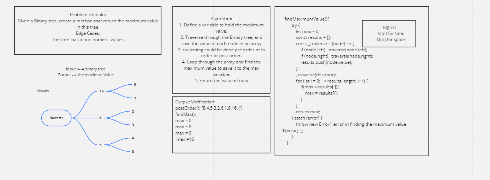

# Trees
* Trees are a way to represent data in a non linear way (unlike arrays, linked lists, stacks and queues).
* Binary trees are composed of nodes with each node only have two children the most (left and right).
* Binary Search Tree is a sorted binary tree where the values that are smaller then the root are located to the left, while the greater values are located to hte right.
* Breadth-First Traversing: It is traversing through the tree line by line from the root node until the leaves nodes. 
* 

## Challenge
Create three classes:
1. Node class with value, left and, right properties.
2. Binary Tree class with preOrder, inOrder, and postOrder methods.
3. Binary tree also have a method that return the maximum value.
4. Binary tree also have a method of breadth-First traversing.
5. Binary Search Tree with add (adding a value in the right order in a tree) and contain (check if a value exists) methods

## Approach & Efficiency
- In Binary tree: The approach was to use a private function (_traverse()) and apply it to each root node and calling it again if a condition is not matched.
- In Binary Search tree: The approach was to divide the tree into left and right halves, then comparing the value (when adding or searching) with the root node and decide the half the (contains or a value should be added to).
- Big O: for time:
- 1. preOrder(): O(n) where n is the number of nodes
  2. inOrder(): O(n) where n is the number of nodes
  3. postOrder(): O(n) where n is the number of nodes
- Binary Search Tree:
  1. add(): log(n)
  2. contain(): log(n)

- Big O: for space:
- 1. preOrder(): O(h) where h is the height of the tree (number of edges)
  2. inOrder(): O(h) where h is the height of the tree 
  3. postOrder(): O(h) where h is the height of the tree 
- Binary Search Tree: 
  1. add(): O(1)
  2. contain(): O(n)

## API
- Binary Tree:
  1. preOrder(): traverse through the tree one node by another starting from the root node, the left node and, then the right.
  2. inOrder(): traverse through the tree one node by another starting from the left node, the root node and, then the right.
  3. postOrder(): traverse through the tree one node by another starting from the left node, the right node and, then the root.
- Binary Search Tree:
  1. add(): add a value in the right node in sorted tree where if the value is smaller then the root then it is should be added on its left, while it is added on its right if it is greater then the root.
  2. contain(): traverse through the tree and check if a value exists. First, check if the value is greater than the root or smaller, then only traverse the half of the tree that matches the comparisons.

## Test:
Node Test : `npm test node.test`  [Link](node.test.js)
Binary Tree : `npm test binaryTree.test`  [Link](binaryTree.test.js)
Binary Tree Maximum Value : `npm test findMaximum.test`
Binary Tree Breadth First Traversing: `npm test breadthFirst.test`
Binary Search Tree : `npm test binarySearchTree.test` [Link](binarySearchTree.test.js)
Code : [Binary Tree](tree.js)

## Resource :
[Binary Search Tree](https://humanwhocodes.com/blog/2009/06/09/computer-science-in-javascript-binary-search-tree-part-1/#:~:text=The%20contains()%20method%20accepts,BinarySearchTree.)

## WhiteBoard for Finding the max value

## WhiteBoard for traversing breadth first method:

