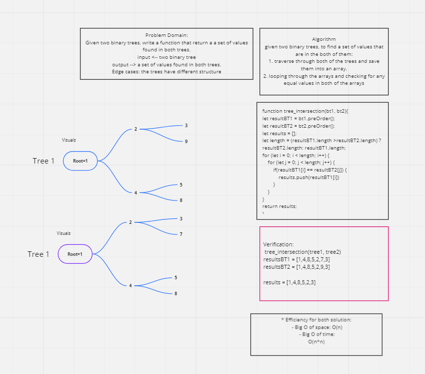

# Trees
* Trees are a way to represent data in a non linear way (unlike arrays, linked lists, stacks and queues).
* Binary trees are composed of nodes with each node only have two children the most (left and right).

## Challenge Description
Given two binary trees, write a function that return a a set of values found in both tree

## Approach & Efficiency
The approach was to traverse each tree and compare the resulting array for matching values.
- Big O: for time:
- preOrder(): O(n) where n is the number of nodes
- treeIntersection(): O(n)

- Big O: for space:
- preOrder(): O(h) where h is the height of the tree (number of edges)
- treeIntersection(): O(n)

## Solution

## Test:
* `npm test tree-intersection.test`
* The code: [Here](./tree-intersection.js)

